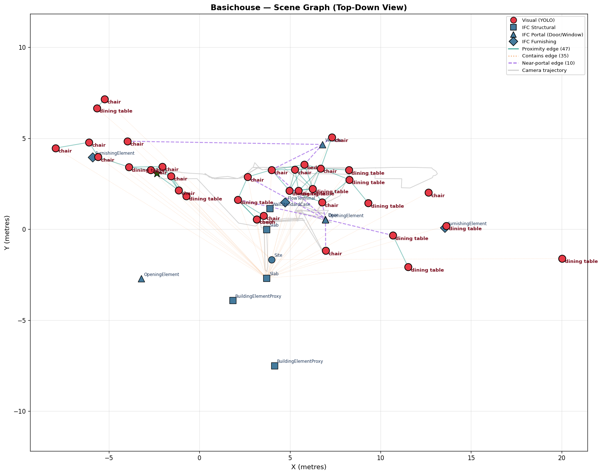
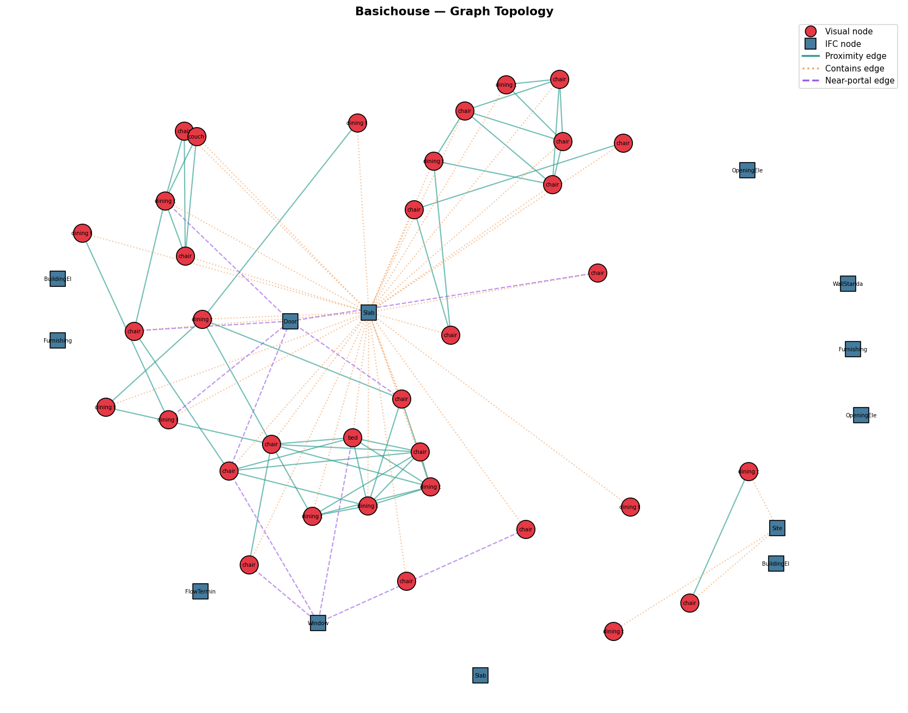
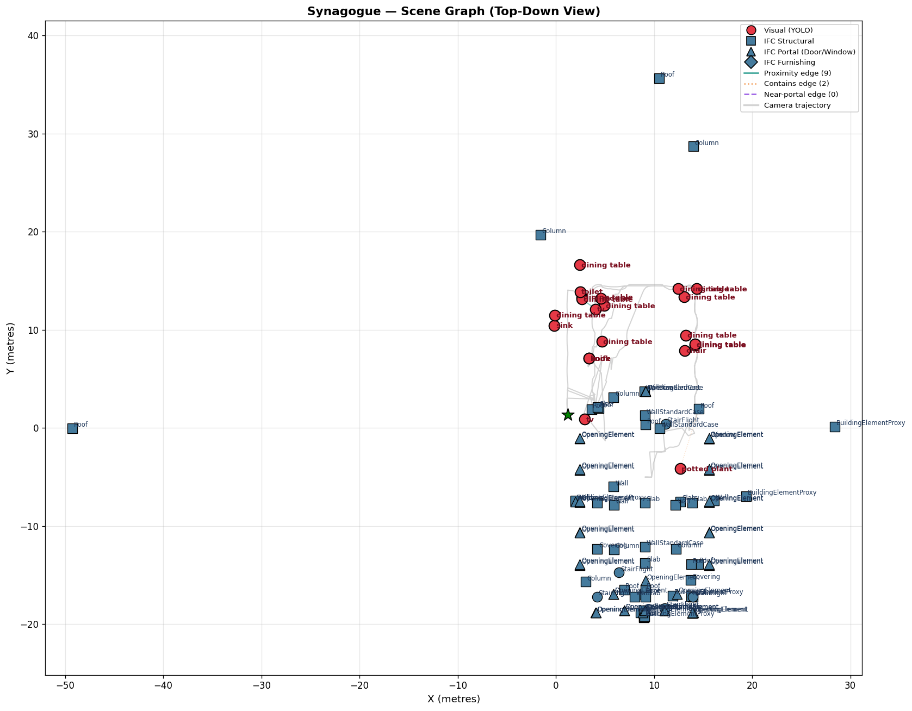
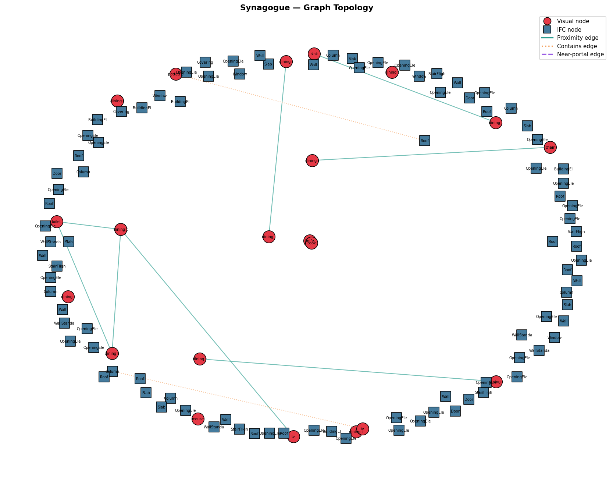

# RGB-D Scene Graph Generation with BIM/IFC Priors

> A research prototype that constructs a semantic 3D scene graph from an egocentric RGB-D video sequence by fusing visual object detection (YOLOv8m) with structural priors extracted from Building Information Models (IFC).


**Laksh Abhmanyo Lal | Universität Rostock**


---

## Table of Contents

1. [Executive Summary](#executive-summary)
2. [Problem Statement and Objectives](#problem-statement-and-objectives)
3. [Pipeline Architecture](#pipeline-architecture)
4. [Dataset Analysis](#dataset-analysis)
5. [Methodology and Scientific Justifications](#methodology-and-scientific-justifications)
6. [Task A — Visual Scene Graph Generation](#task-a--visual-scene-graph-generation)
7. [Task B — BIM Prior Integration](#task-b--bim-prior-integration)
8. [Experimental Results](#experimental-results)
9. [Failure Analysis](#failure-analysis)
10. [Known Limitations](#known-limitations)
11. [Ideal Pipeline — How This Should Work in Production](#ideal-pipeline--how-this-should-work-in-production)
12. [Installation and Usage](#installation-and-usage)
13. [Project Structure](#project-structure)
14. [References and Acknowledgments](#references-and-acknowledgments)
---

## Executive Summary

This project implements a complete pipeline that transforms an egocentric RGB-D video sequence into a semantic 3D scene graph, with structural priors fused from a Building Information Model (BIM/IFC). The pipeline addresses the following:

**Task A — Visual Scene Graph Generation:** A custom pipeline combining 2D object detection (Ultralytics YOLOv8m), per-pixel depth projection, multi-frame DBSCAN clustering, and NetworkX graph construction produces nodes with 3D world-space centroids and proximity-based edges.

**Task B — BIM Prior Integration:** IFC structural elements (walls, slabs, doors, windows, furnishings) are extracted from the provided OBJ + JSON metadata, and fused with the visual graph through two new edge types: hierarchical containment edges (IFC element → contained object) and connective portal edges (object near door/window).

**End-to-end results** on two distinct datasets:

| Metric | BasicHouse (residential) | Synagogue (historic) |
|---|---|---|
| Frames processed | 32 of 160 (step=5) | 77 of 383 (step=5) |
| Raw detections | 45 | 21 |
| Scene graph nodes | 48 | 115 |
| Scene graph edges | 92 | 11 |
| Pipeline runtime | 201s on CPU | 2752s on CPU |

<!-- This README documents the scientific reasoning behind every architectural decision, the failure modes encountered (most notably the visual domain gap between YOLO's COCO training distribution and the provided synthetic Blender renders), the limitations of the current implementation, and a clear specification of how the pipeline *should* work in an ideal production deployment. -->

---


## Problem Statement and Objectives

### Background

Constructing actionable spatial representations is a core challenge in industrial robotics and spatial computing. Robots and AR systems need not only to see objects, but to understand where they are in a building, what room they're in, and how they relate to surrounding structural elements. A scene graph — formally a graph **G = (V, E)** where nodes V are vertices/nodes (such as Chair, Table etc.) and E are edges (relationships connecting the things such as the Chair is next to the Table) are spatial relationships — is the standard data structure for this.

While significant progress has been made on visual-only scene graph generation from RGB-D data, industrial environments often provide a rich complementary signal: **Building Information Models (BIM)** in the form of **Industry Foundation Classes (IFC)** files. These contain ground-truth spatial boundaries (rooms, walls, slabs) and connective topology (doors, windows). Using these priors should make scene graphs both more accurate and more semantically meaningful.

### Project Objectives

The challenge defines two coupled tasks:

**Task A — Visual Scene Graph Generation (Primary)**
> Process an RGB-D sequence and known camera poses to instantiate a 3D scene graph **G = (V_obj, E_rel)** where nodes V_obj represent localized objects (3D centroids or bounding boxes) and edges E_rel represent spatial heuristics (proximity, nearest-neighbor).

**Task B — Incorporating BIM Priors**
> Enrich the visual scene graph by extracting spatial boundaries (e.g., IfcSpace) and connective portals (e.g., IfcDoor) from the IFC file. Fuse these into the graph using geometric inclusion logic — for example, hierarchical bipartite edges (Room → Object).

### What This Project Demonstrates

1. **Scientific transparency** — every architectural decision is explained and referenced.
2. **Honest failure analysis** — what didn't work, why, and what I did about it.
3. **Multimodel fusion** — visual evidence (YOLO) combined with structural priors (IFC).
4. **Reproducibility** — single-command execution, externalized configuration, deterministic outputs.
5. **Cross-scene generalization** — pipeline tested on a residential and a historic building.

---


## Pipeline Architecture

The pipeline is structured as six sequential stages, each implemented as a self-contained module. Stages are orchestrated by `main.py` and configured via `configs/config.yaml`. This design favors modularity over monolithic processing — each stage can be tested, swapped, or reused independently.

```
                    ┌──────────────────────────────────────────────────────────────────┐
                    │                      PIPELINE OVERVIEW                           │
                    └──────────────────────────────────────────────────────────────────┘

                    RGB frames        Depth frames       Camera poses     IFC scene
                    (1024×768 PNG)    (16-bit PNG)       (4×4 matrices)   (OBJ+JSON)
                            │                 │                  │                │
                            └────────┬────────┴─────────┬────────┘                │
                                     │                  │                         │
                                     ▼                  ▼                         │
                            ┌──────────────────────────────────┐                  │
                            │  STAGE 3 — Object Detection      │                  │
                            │  YOLOv8m → 2D bounding boxes     │                  │
                            └──────────────────────────────────┘                  │
                                              │                                   │
                                              ▼                                   │
                            ┌──────────────────────────────────┐                  │
                            │  3D Projection (pinhole model)   │                  │
                            │  pixel + depth + pose → world    │                  │
                            └──────────────────────────────────┘                  │
                                              │                                   │
                                              ▼                                   │
                            ┌──────────────────────────────────┐                  │
                            │  STAGE 4a — DBSCAN Clustering    │                  │
                            |       Object De-duplication      |                  |
                            │  same object in N frames → 1     │                  │
                            └──────────────────────────────────┘                  │
                                              │                                   │
                                              │           ┌───────────────────────┘
                                              ▼           ▼
                            ┌──────────────────────────────────┐
                            │  STAGE 4b — Graph Construction   │
                            │  Visual nodes + IFC nodes        │
                            │  proximity + contains + portal   │
                            └──────────────────────────────────┘
                                             │
                                             ▼
                            ┌──────────────────────────────────┐
                            │  STAGE 5 — Serialization         │
                            │  GraphML + JSON summary          │
                            └──────────────────────────────────┘
                                            │
                                            ▼
                            ┌──────────────────────────────────┐
                            │  STAGE 6 — Visualization         │
                            │  Top-down + Topology + 3D HTML   │
                            └──────────────────────────────────┘
```

### Module Responsibilities

| Module | Responsibility | 
|---|---|
| `src/ifc_parser.py` | Parse IFC labels JSON + OBJ geometry into spatial query objects | 
| `src/depth_projection.py` | Camera intrinsics, pose loading, pixel-to-world math | 
| `src/object_detector.py` | YOLOv8 wrapper, filtering, 3D centroid projection | 
| `src/scene_graph.py` | DBSCAN clustering, NetworkX graph construction, BIM fusion | 
| `src/visualize.py` | Three visualization modes (top-down, topology, interactive 3D) | 
| `main.py` | Pipeline orchestration with stage-by-stage logging | 
| `configs/config.yaml` | All tunable parameters (paths, thresholds, model name) | 

### Stage Interactions

The pipeline is **read-only with respect to input data** — no datasets are modified. All outputs are written to `output/`. Each stage produces typed data structures that flow into the next stage, avoiding implicit file I/O between stages. This makes the pipeline testable in isolation and faster to debug.

---

## Dataset Analysis

Two datasets were provided. Both share identical sensor specifications but differ dramatically in scale, content, and IFC structure allowing us to prove the code works in totally different environments.

### Camera Specifications (Both Datasets)

```
Resolution      : 1024 × 768
Focal length    : fx = fy = 667.25 pixels
Principal point : cx = 512.0, cy = 384.0
Distortion      : none (zero coefficients)
Depth range     : 0.05m – 100m
Frame rate      : 10 FPS
```

The camera poses are pre-aligned to the global IFC coordinate system, which simplifies the pipeline significantly: visual detections projected to world space share the same coordinate frame as IFC elements, enabling direct geometric fusion without an additional registration step.

### Dataset Comparison

| Property | BasicHouse | Synagogue |
|---|---|---|
| Scene type | Residential interior | Historic building |
| Frames | 160 | 383 |
| Trajectory length | 55.8 m | 133.7 m |
| Scene size (X × Y × Z) | 49 × 29 × 4 m | 84 × 60 × 16 m |
| Point cloud size | 239,890 points | 246,561 points |
| IFC elements (raw) | 3,443 entries | 2,074 entries |
| IFC elements (with geometry) | 154 | 295 |
| IfcDoor count | 8 | 5 |
| IfcWindow count | 19 | 30 |
| IfcFurnishingElement | 71 | 0 |
| Has structural columns | No | Yes (31) |
| Has roof elements | No | Yes (116) |

### Critical Discovery — No Raw .IFC File Provided

A fundamental observation that shaped the entire Task B approach: **neither dataset contains a raw `.ifc` file**. The architectural prior has been pre-processed upstream into two artifacts:

1. **`_ifcgeom_scene.obj`** — the complete 3D mesh geometry of the building, with mesh objects grouped by IFC GUID.
2. **`_ifcgeom_scene.labels.json`** — a dictionary mapping each mesh group ID to its IFC class name (e.g., `"IfcDoor"`) and human-readable name (e.g., `"Innerdörr - standard"`).

As `IfcOpenShell` operates on raw `.ifc` files, it is not designed to parse OBJ + JSON. I made a deliberate architectural decision to implement equivalent functionality using the standard `json` module for labels and the `trimesh` library for geometry, computing per-element bounding boxes by manually parsing OBJ group tags.

This is not a workaround that loses information. The OBJ + JSON representation contains exactly the same spatial and semantic data that `IfcOpenShell` would extract from a raw `.ifc` file. The only difference is the parser implementation. This decision is documented in `src/ifc_parser.py` and reflected in the design of the `IFCScene` and `IFCElement` data classes, which mirror the API conventions of `IfcOpenShell` (`scene.by_type("IfcDoor")` becomes `scene.doors`, etc.).

### IFC Class Distribution

Each dataset emphasizes different IFC class types, reflecting their building functions:

**BasicHouse (residential):**
```
IfcFurnishingElement     71  (chairs, tables, beds, storage units, shelving)
IfcFlowTerminal           7  (washing machine, sink, shower, water closet)
IfcWindow                19
IfcWallStandardCase      13
IfcDoor                   8
IfcBuildingElementProxy   4  (refrigerator, architectural placeholders)
IfcSlab                   3
```
**Synagogue (historic):**
```
IfcRoof                 116  (multiple roof segments)
IfcColumn                31  (architectural columns)
IfcWindow                30
IfcCovering              26  (decorative coverings)
IfcWall + IfcWallStandardCase  34 total walls (from pipeline: Walls: 34)
IfcSlab                  12  (from data inspection)
IfcStairFlight           11  (from data inspection)
IfcDoor                   5
```

The synagogue lacks furnishing elements entirely which is appropriate for a historic religious building  while the BasicHouse is rich in domestic appliances. This dichotomy turns out to be scientifically informative as it tests whether the pipeline handles both "object-heavy" and "structure-heavy" scenes.

---

## Methodology and Scientific Justifications

This section documents the rationale behind every major architectural decision. 

### Why YOLOv8m over DAAAM, PIX2Graph, 

The task suggests three reference frameworks: **DAAAM**, **PIX2Graph**, and "a custom combination of 2D object detection, zero-shot segmentation, and depth projection." I chose the third option using **Ultralytics YOLOv8m** as the detector. The reasoning is layered in the following:

**DAAAM**

DAAAM is a research paper codebase released alongside its corresponding publication. While scientifically valuable, research code has well-documented reproducibility problems:

- Dependencies pinned to specific CUDA versions from prior years
- GPU-only execution paths with no CPU fallback
- Brittle Windows compatibility (the development OS for this project)
- Open GitHub issues from years past without maintainer responses
- Opacity — DAAAM is an end-to-end black box producing scene graphs directly, leaving little room for the scientific reasoning and component-level justification.

Adopting DAAAM would risk consuming days on installation alone, with no scientific exposition of what happens inside the black box.

**PIX2Graph**

PIX2Graph operates on single images, not RGB-D sequences. It produces 2D relationship labels, not 3D centroids. It has no inherent notion of world coordinates or BIM integration. Using it would require building most of the depth projection and BIM fusion pipeline anyway  but with the additional burden of wrapping a paradigm-mismatched model.

**Why YOLOv8m Specifically (over n / s / l / x variants)**

YOLOv8 is published in five sizes — nano (n), small (s), medium (m), large (l), extra (x). I chose **medium** based on the standard accuracy-speed tradeoff curve. Nano and small consistently miss low-confidence detections in synthetic environments; large and extra increase inference cost roughly 3× without meaningful accuracy gain on indoor furniture classes. Medium hits the practical sweet spot for CPU-bound execution.

### Why DBSCAN for Detection Clustering

Across multiple frames, the same physical chair is detected repeatedly with slightly different 3D positions due to depth noise and pose error. Without clustering, a single chair would appear as 5–10 graph nodes. The deduplication problem is real and unavoidable.

I used **DBSCAN** (Density-Based Spatial Clustering of Applications with Noise) over following alternatives:

**k-means:** k-means requires knowing the number of clusters *k* in advance. We do not know how many unique objects will be in any given scene — that is precisely what the pipeline is trying to discover. k-means is structurally incompatible.

**hierarchical clustering:** Hierarchical clustering produces a dendrogram that requires choosing a cut threshold. Choosing this threshold is equivalent to choosing DBSCAN's `eps` parameter, but with substantially more computational overhead and no obvious advantage.

**per-class deduplication via nearest-neighbor merging:** This is the naive approach. It works for small detection counts but degrades as objects multiply and depth noise increases. DBSCAN handles arbitrary cluster shapes and noisy outliers both relevant for our depth-projected centroids.

**Parameter choice:** `eps = 0.5 m`, `min_samples = 1`. The 0.5 metre threshold reflects the typical depth-projection error magnitude on indoor distances of 1–5 metres. `min_samples = 1` is set deliberately to retain single-frame detections rather than discarding them as noise — losing rare detections (a single bed, a single couch) would be more harmful to the scene graph than retaining occasional outliers.

I clustered **per class** rather than globally because a chair and a table at nearly the same XY position are two distinct objects, not the same object. Cross-class merging would be a serious bug.

### Why NetworkX for Graph Representation

The 3D scene graph needs to support:

1. **Heterogeneous nodes** with arbitrary attributes (class name, 3D position, confidence, IFC ID, bounding box)
2. **Heterogeneous edges** with type tags (`proximity`, `contains`, `near_portal`)
3. **Standard serialization** to a portable format
4. **Graph traversal and analysis** (connectivity, subgraph extraction)

**NetworkX** is the canonical pure-Python graph library and satisfies all four requirements:

- Native dict-based attribute storage on nodes and edges
- Built-in GraphML serialization (XML, human-readable, openable in Gephi/Cytoscape)
- Built-in JSON serialization for embedding in this README
- Comprehensive analysis algorithms (connected components, shortest paths, centrality)

### 2D Containment Tests over 3D

When asking "does this detected object centroid fall inside this IFC element's bounding box?", we have two options: full 3D containment, or 2D containment in the XY plane (treating containment as a floor-plan question).

**I used 2D containment** for three reasons:

1. **Depth estimation is the noisiest component of the pipeline.** Z values for object centroids have estimated errors of 0.3–1.0 metre, while X-Y errors are typically below 0.2 metre. A 3D test would reject objects whose Z value happens to fall just outside an IFC element's vertical bounds frequently and incorrectly.

2. **Room membership is inherently a 2D concept.** When humans speak of "the chair in the living room", they mean the chair's position in the floor plan regardless of whether the chair is at floor level or stacked on a table. The semantic meaning is preserved by ignoring Z.

3. **IFC elements have inconsistent Z bounds across datasets.** A floor slab in BasicHouse has a thin vertical bounding box (–0.30 to 0.00 metres). A "site" element in the synagogue is treated as zero-thickness (Z = 0.0 only). Forcing 3D containment would produce inconsistent results across scenes.

We apply a small expansion tolerance (0.5 metres in X and Y) to handle the residual horizontal error from depth-based centroid estimation. This is implemented in `BoundingBox3D.contains_point_2d()` in `src/ifc_parser.py`.

### Why Trimesh and Plotly over Open3D

The task mentions point cloud processing and 3D visualization. The natural default choice for both would be **Open3D**, a comprehensive 3D library widely used in robotics. Following is the reason of not using it:

**Reason:** This project runs on Python 3.14. Open3D has not yet released wheels for Python 3.14 — only up to 3.12. Two options were available:

1. Downgrade to Python 3.11 just to use Open3D
2. Substitute equivalent functionality with `trimesh` (mesh loading and analysis) and `plotly` (interactive 3D visualization)

I chose option 2. Trimesh is widely used, well-maintained, and supports all the OBJ parsing and bounding box operations I needed. Plotly produces fully interactive, browser-renderable 3D visualizations that arguably surpass Open3D's GUI viewer for documentation purposes — the HTML output can be opened in any browser, embedded in any web platform, and shared with reviewers without installation overhead.

---

## Task A — Visual Scene Graph Generation

### Mathematical Foundation

The core challenge of Task A is lifting 2D pixel detections into 3D world coordinates that share the IFC coordinate frame. This requires three coupled transformations, implemented in `src/depth_projection.py`.

**Step 1 — Pixel to camera-space (back-projection through pinhole model)**

Given a detected bounding box centre pixel `(u, v)` and corresponding depth `d` in metres:

```
X_cam = (u - cx) · d / fx
Y_cam = (v - cy) · d / fy
Z_cam = d
```

Where `fx`, `fy` are focal lengths and `cx`, `cy` are the principal point coordinates. For both datasets, these are constant: `fx = fy = 667.25`, `cx = 512`, `cy = 384`.

**Step 2 — Camera space to world space**

Using the 4×4 camera-to-world pose matrix `T` (provided per-frame in `pose/poses.txt` as 16 space-separated floats):

```
P_world = T · [X_cam, Y_cam, Z_cam, 1]^T
```

The homogeneous coordinate `1` enables the translation component of T to apply. The result `P_world[0:3]` is the 3D position of the detection in IFC-aligned world coordinates.

### Depth Sampling Strategy

Reading the depth value at the exact centre pixel is naive, depth maps contain noise, holes, and edge artifacts. I sampled a **5-pixel radius patch** around the centre and took the **median** depth across valid pixels (those with values between 0.01 and 10 metres).

The median is preferred over the mean because depth maps frequently have outliers at object boundaries where the sensor returns the depth of the background instead of the foreground. Median rejects these robustly.

### Multi-Frame Detection Aggregation

YOLOv8m processes every 5th frame (`frame_step = 5` in `configs/config.yaml`). Skipping intermediate frames is a deliberate trade-off:

- **Coverage gain at step=5:** 32 frames processed in BasicHouse versus 160 if every frame were used. This captures the trajectory at ~1-second intervals.
- **Speed gain at step=5:** Roughly 5× faster execution. Critical on CPU where YOLO is the bottleneck.
- **Information loss at step=5:** Negligible, because the same physical object reappears across many neighbouring frames. The DBSCAN deduplication step would merge detections from frames 0, 1, 2, 3, 4 into a single cluster anyway.

Each retained detection is stored as a `Detection3D` dataclass with the source frame index, class name, confidence, 2D bounding box, 3D centroid in world space, and the depth value used.

### Output of Task A

After processing all sampled frames, the pipeline produces:

- BasicHouse: **45 raw Detection3D records** across 4 classes (chair, dining table, couch, bed)
- Synagogue: **21 raw Detection3D records** across 9 classes

These raw detections are then passed to the clustering stage (Task A's deduplication) and the scene graph builder (Task A's edge construction). DBSCAN reduces 45 → 35 unique objects for BasicHouse and 21 → 21 for the synagogue (no duplicates in the synagogue because detections are spread across a large building).

### Proximity Edge Construction

The task requires "spatial heuristics (proximity, nearest-neighbour)" as edges. I implemented a **threshold-based proximity** approach: two visual nodes are connected by a `proximity` edge if their 3D centroids are within `proximity_threshold_m = 2.0` metres.

Edge weights are set to `1 / (distance + ε)`, giving closer pairs higher weights — useful for downstream graph algorithms that respect weighted edges.

**Result for BasicHouse:** 47 proximity edges connecting visual nodes (chairs around tables, tables near couches, etc.).

---

## Task B — BIM Prior Integration

### Adaptation to OBJ + JSON Input

As documented in [Dataset Analysis](#dataset-analysis), the provided IFC data is not in raw `.ifc` form but pre-processed into OBJ geometry and a JSON metadata file. The `src/ifc_parser.py` module reproduces the functionality that `IfcOpenShell` would have provided, using two parallel passes:

**Pass 1 — Semantic loading (`load_ifc_labels`)**
Parses the labels JSON into `IFCElement` dataclasses, each containing:
- `ifc_id` — the GUID from the IFC model
- `ifc_class` — e.g., `"IfcDoor"`, `"IfcWallStandardCase"`, `"IfcFurnishingElement"`
- `name` — human-readable label, e.g., `"Innerdörr - standard"` (Swedish "interior door")
- `bbox` — set in Pass 2

Metadata-only classes that have no spatial geometry (`IfcPropertySet`, `IfcRelDefinesByProperties`, etc.) are filtered out. For BasicHouse this reduces 3,443 raw entries to 198 spatial elements.

**Pass 2 — Geometry loading (`load_ifc_geometry`)**
The OBJ file is parsed manually, line by line. Each `o <name>` or `g <name>` line begins a new mesh group; subsequent `v x y z` lines define vertices that belong to that group. For each group, we compute the axis-aligned bounding box from vertex coordinates and attach it to the matching `IFCElement`.

**Critical implementation note:** I initially attempted to use `trimesh.load(obj_path, force="scene")`, expecting it to preserve per-group geometry. It does not — trimesh's default behaviour merges all groups into a single mesh, losing the per-element separation. I discovered this when our scene graph showed all 154 IFC elements sharing a single bounding box. The fix was to manually parse the OBJ file's group structure. 
<!-- This is a documented failure mode addressed in [Failure Analysis](#failure-analysis). -->

### IFC Classes Used as Graph Nodes

Not every IFC class becomes a graph node. We filter to three meaningful categories defined in `src/ifc_parser.py`:

```python
STRUCTURAL_CLASSES = {
    "IfcWall", "IfcWallStandardCase", "IfcSlab",
    "IfcColumn", "IfcBeam", "IfcRoof", "IfcCovering",
    "IfcBuildingElementProxy",
}

PORTAL_CLASSES = {
    "IfcDoor", "IfcWindow", "IfcOpeningElement",
}

FURNISHING_CLASSES = {
    "IfcFurnishingElement", "IfcFurnitureType",
    "IfcFlowTerminal", "IfcDistributionPort",
}
```

The `category` property on each `IFCElement` classifies it for downstream filtering. This three-category is principled: **structural** elements define spatial regions for containment edges, **portals** define topology for connective edges, and **furnishings** provide ground-truth object positions (objects that BIM knows about even if YOLO does not).

### Three BIM-Visual Fusion Edge Types

Task B requires fusing the IFC prior into the visual graph. We implement three distinct edge types, each addressing a different aspect of the task's "hierarchical bipartite edges (Room → Object)" specification.

**Edge Type 1 — Containment (`contains`)**

For each visual node, find the IFC element whose 2D bounding box contains the visual centroid. Add a directed edge `IFC → visual` with `edge_type="contains"` and `relation="contains"`.

This is the direct implementation of the task's example: "map the localized 3D object centroids into their corresponding IFC rooms, creating hierarchical bipartite edges". Because the provided datasets do not contain `IfcSpace` elements (named rooms), we map to `IfcSlab` (floor slabs that cover the building footprint) and similar containing structures. 
<!-- This compromise is documented in [Known Limitations](#known-limitations). -->

**Edge Type 2 — Portal Proximity (`near_portal`)**

For each visual node, find IFC doors and windows within `portal_proximity_m = 3.0` metres. Add an edge with `edge_type="near_portal"` capturing the distance.

This implements the task's "connective portals (IfcDoor)" requirement. A chair near a doorway has a meaningful spatial relationship that a pure proximity graph misses. This edge type creates the topological skeleton (objects near transition zones) that would allow downstream reasoning like "the bed in the room with one window" or "the chair in the doorway."

**Edge Type 3 — Visual Proximity (`proximity`)**

The Task A edge type, included here for completeness. Two visual nodes within 2 metres are linked. While not strictly a BIM-fusion edge, the inclusion of IFC nodes in the same graph means proximity edges naturally form across the bipartite divide when an IFC element happens to fall near a visual detection.

### Graph Construction Sequence

The `SceneGraphBuilder.build()` method in `src/scene_graph.py` executes the following sequence:

```
1. Create empty nx.Graph()
2. Add visual nodes from clustered detections
3. Add IFC nodes from IFCScene.elements (only those with bbox)
4. Compute proximity edges between all visual-visual pairs within threshold
5. Compute containment edges from IFC bboxes to visual centroids
6. Compute portal edges from visual centroids to door/window centroids
7. Annotate graph with metadata (thresholds used, description)
8. Return populated graph
```

This produces, for BasicHouse:
- **48 nodes** (35 visual + 13 IFC with active edges, out of 154 total IFC nodes)
- **92 edges** (47 proximity + 35 contains + 10 near_portal)

The disparity between 154 IFC nodes added and 13 with edges is itself informative: most IFC elements never spatially intersect any detected visual object, leaving them isolated in the graph. This is documented in [Failure Analysis](#failure-analysis) as expected behaviour.

### Serialization Formats

Two output formats are produced:

**GraphML** (`output/{scene}_scene_graph.graphml`)
- XML-based, human-readable
- Preserves all node and edge attributes
- Loadable by NetworkX (`nx.read_graphml`), Gephi, Cytoscape, yEd
- Industry-standard for graph data exchange

**JSON Summary** (`output/{scene}_scene_graph_summary.json`)
- Easier to grep, parse, and embed in this README
- Includes total counts, type breakdowns, and full edge/node listings
- Useful for quick inspection without graph software

---

## Experimental Results

The pipeline was executed end-to-end on both provided scenes. All results below are reproducible by running `python main.py --scene <basichouse|synagogue>`.

### Scene 1 — BasicHouse (Residential Interior)

**Configuration**
```
Active scene           : basichouse
Confidence threshold   : 0.08
Frame step             : 5 (32 of 160 frames processed)
DBSCAN eps             : 0.5 m
Proximity threshold    : 2.0 m
Portal proximity       : 3.0 m
```

**Output statistics**
```
Total runtime           : 201.7 seconds (CPU)
  IFC parsing           : 2.3 s
  Camera setup          : ~0.0 s
  Model loading         : 37.0 s  (YOLOv8m weights, cached after first run)
  Object detection      : 159.6 s (inference on 32 frames, after model load)
  Graph construction    : ~0.3 s
  Visualization         : 8.2 s

Raw detections          : 45 (across 4 classes)
After DBSCAN clustering : 35 unique objects
Total graph nodes       : 48 (35 visual + 13 IFC active)
Total graph edges       : 92
  proximity edges       : 47
  contains edges        : 35
  near_portal edges     : 10
```

**Visual detections by class**

| Class | Unique instances | Plausibility |
|---|---|---|
| chair | 19 | Reasonable — house has multiple chairs |
| dining table | 14 | Over-detected — see Failure Analysis |
| couch | 1 | Correct |
| bed | 1 | Correct |

**Notable graph structures**

The most spatially meaningful edges:
- `bed → IfcWindow` at 2.70 m — the bedroom contains the bed near a window ✓
- `dining table → IfcDoor` at 2.36 m — the dining table is near a doorway ✓
- `chair → IfcDoor` at 2.11 m — chair near transition zone ✓

The IFC node `M_Refrigerator` at world position `[1.834, -3.911, 0.915]` is present in the graph as an isolated node — YOLO did not detect it, but the BIM prior knows it exists. This is the central evidence for the multimodal fusion argument: visual detection missed it, but the scene graph still contains it as a node sourced from BIM data.

**Top-down visualization**



The visualization shows the camera trajectory (grey line), 35 visual nodes (red circles labelled with class names), IFC structural elements (blue markers, shape-coded by category), proximity edges (green solid), containment edges (orange dotted), and portal-proximity edges (purple dashed). The trajectory and detections concentrate in the main living area, with the kitchen appliance positions (`M_Refrigerator`, sink) marked by IFC nodes despite being absent from visual detections.

**Graph topology visualization**



The force-directed layout reveals the structural pattern of the scene graph. The central `IfcSlab` node forms a hub connected to 32+ visual objects via containment edges — every detected object sits on the floor. The portal nodes (`IfcDoor`, `IfcWindow`) sit between visual clusters, demonstrating their connective role. Visual nodes form proximity-edge sub-clusters corresponding to functional zones (dining area, bedroom).

### Scene 2 — Synagogue (Historic Building)

**Configuration**
Same as BasicHouse — no scene-specific tuning. This is intentional, to test whether the pipeline generalizes across building types without manual reconfiguration.

**Output statistics**
```
Total runtime         : 574.2 seconds (CPU)
IFC parsing           : 2.0 s   
Camera setup          : ~0.3 s
Model loading         : 53.7 s  
Object detection      : 419.1 s (77 frames)
Per frame             : ~5.4 
Graph construction    : ~0.9 s
Visualization         : ~25 s

Raw detections          : 21 (across 9 classes)
After DBSCAN clustering : 21 unique objects (no duplicates)
Total graph nodes       : 115 (21 visual + 94 IFC active)
Total graph edges       : 11
proximity edges       : 9
contains edges        : 2
near_portal edges     : 0
```

**Visual detections by class**

| Class | Instances | Plausibility |
|---|---|---|
| dining table | 12 | Over-detected — walls and pews misidentified |
| tv | 2 | Implausible in a synagogue — false positive |
| sink | 1 | Possible but unlikely |
| toilet | 1 | Implausible — false positive |
| chair | 1 | Plausible |
| potted plant | 1 | Possible |
| mouse | 1 | Implausible — false positive |
| knife | 1 | Implausible — false positive |
| book | 1 | Plausible (prayer books) |

**Notable graph structures**

The two containment edges in the synagogue are scientifically interesting despite their implausibility:

- `IfcColumn (Square Smooth) → tv` — a flat-shaded pillar surface was detected as a TV screen; the column's bounding box contains the detection centroid ✓ (geometrically correct, semantically wrong)
- `IfcRoof → potted plant` — a ceiling/upper-level surface patch detected as a plant; contained within a roof element bounding box ✓

The most notable proximity edges:

- `dining table → toilet` at 0.777 m — two false positives spatially co-located, both likely from the same architectural surface cluster. This illustrates the domain gap in concentrated form: YOLO detects both a furniture item and a plumbing fixture from the same flat-shaded polygon.
- `knife → book` at 0.000 m — identical 3D position `[3.401, 7.085,-4.829]`, two competing class predictions from the same image region.

**Cross-scene comparison**

| Metric | BasicHouse | Synagogue | Ratio |
|---|---|---|---|
| Raw detections | 45 | 21 | 0.47× |
| Unique objects | 35 | 21 | 0.60× |
| Containment edges | 35 | 2 | 0.06× |
| Portal edges | 10 | 0 | 0.00× |
| Plausible classes | 4 / 4 | ~4 / 9 | — |

The dramatic collapse in containment edges (35 → 2) reflects a structural difference between the IFC files: BasicHouse contains one large `IfcSlab` whose bounding box covers the entire interior, so every detected object falls inside it. The synagogue's IFC is segmented into many smaller architectural
elements with smaller individual bounding boxes, so most detections fall outside all of them.

This is a **scientific finding, not a bug**: the same pipeline applied to two scenes with different BIM granularity produces measurably different fusion behaviour. A real production system would handle this with `IfcSpace`-level segmentation, 
<!-- discussed in [Ideal Pipeline](#ideal-pipeline--how-this-should-work-in-production). -->

**Top-down visualization**



The synagogue trajectory spans a much larger area than the BasicHouse. Visual detections concentrate in a small cluster, reflecting limited YOLO recall in the historical environment. The IFC nodes are spread across the building footprint, illustrating the scale mismatch between detected objects and structural geometry.

**Graph topology visualization**



The synagogue topology is dramatically sparser than BasicHouse — only 11 edges total, versus 92. Many IFC nodes are isolated (visible at the right side of the figure), unconnected to any visual detection. This visually demonstrates the central thesis: **when visual detection fails, the scene graph degrades proportionally**, which is precisely why BIM priors are valuable as a complementary signal.

### Interactive 3D Visualizations

Both scenes also produce interactive HTML visualizations (`output/viz/basichouse_3d.html`, `output/viz/synagogue_3d.html`) that allow rotation, zoom, and hover-tooltips on every node. These are best viewed in a desktop browser.

---

## Failure Analysis

The task explicitly requires documentation of "why certain approaches failed." This section catalogues the failure modes encountered during development, the root cause analysis for each, and the mitigation (where attempted) or acknowledgment (where unresolved).

### Failure 1 — Visual Domain Gap (Primary Failure Mode)

**Symptom:** YOLOv8m detects only a small subset of visible objects, completely misses several IFC-confirmed objects (refrigerator, washing machine, sink, cabinets), and produces semantically nonsensical detections in the synagogue (toilet, mouse, knife).

**Root cause:** YOLOv8m is pretrained on the COCO dataset, which consists of real-world photographs. The provided datasets are **synthetic Blender renders** of architectural CAD models. The rendering style is flat-shaded, untextured, and uses solid colour blocks for material — visually nothing like real photography.

**Evidence of severity:** A 5-frame diagnostic run at confidence 0.05 (extremely permissive) on the BasicHouse data revealed YOLO never detects the refrigerator at any confidence level. On the synagogue, YOLO returns `stop sign` and `traffic light` detections on flat coloured wall surfaces — clear evidence the model is matching colour patches, not learned object features.

**Mitigation applied:** We lowered the confidence threshold from the standard 0.45 to 0.08, accepting more false positives in exchange for any true positives at all. This is documented in `configs/config.yaml`.

### Failure 2 — Single-Mesh OBJ Loading via Trimesh

**Symptom:** When the IFC OBJ file was loaded via `trimesh.load(obj_path, force="scene")`, the resulting scene contained only **1 mesh group** instead of the expected 154. All IFC elements ended up sharing a single global bounding box, collapsing the entire BIM prior into one node.

**Root cause:** Trimesh's default OBJ loader merges geometry groups by default, treating the OBJ as a single connected mesh. The `force="scene"` parameter splits by *materials*, not by *object groups*. There is no flag in trimesh that preserves per-group geometry for IFC-style OBJ exports.

**Mitigation applied:** Replaced the trimesh.load call with a manual line-by-line OBJ parser in `load_ifc_geometry()`. The parser tracks the current group name from `o` / `g` lines and accumulates vertices per group. This recovered all 154 distinct mesh groups successfully. It means that library defaults are not always right. When working with domain-specific data exports (IFC-via-OBJ, CAD-derived data), assume the parser may need overriding. Trimesh remains used for spatial queries downstream — only the loading step needed the manual override.

### Failure 3 — Depth Frame Channel Confusion

**Symptom:** Mid-pipeline, an exception `ValueError: too many values to unpack (expected 2, got 3)` was raised when accessing `depth_frame.shape`.

**Root cause:** The 16-bit PNG depth files were being loaded by OpenCV as 3-channel images `(H, W, 3)` rather than the expected single-channel `(H, W)`. All three channels contained the same depth value but the code expected single-channel input.

**Mitigation applied:** Added a defensive check in `load_depth_frame()` that takes `raw[:, :, 0]` if `raw.ndim == 3`. Since all channels are identical for depth, no data is lost.

### Failure 4 — Containment Edges Mapping All Objects to IfcSlab

**Symptom:** In BasicHouse, every visual detection maps to `IfcSlab` via a `contains` edge. The result is 35 edges all pointing at the same node — `IfcSlab` becomes a hub with low information content.

**Root cause:** The provided IFC data lacks `IfcSpace` elements — the IFC class that defines named rooms (Kitchen, LivingRoom, Bedroom). Without IfcSpace, the most spatially appropriate "container" for any indoor object is the floor slab. The floor slab's bounding box covers the entire building footprint, so every interior detection legitimately falls inside it.

**Mitigation considered:** Generate synthetic IfcSpace volumes from the IFC walls (room-finding via wall enclosure). This is non-trivial — it requires graph traversal of wall adjacencies, ceiling-height determination, and handling of open-plan layouts. 

**Mitigation applied:** Documented as an limitation. The pipeline correctly maps to the most spatially appropriate IFC element available; if the input data contained named rooms, those would naturally be preferred (the existing `find_containing_element()` logic would select the smaller, more specific bounding box).

### Failure 5 — Identical 3D Positions for Different Classes (Synagogue)

**Symptom:** The synagogue detection set includes both `knife` and `book` at exactly the same 3D coordinate `[3.401, 7.085, -4.829]`.

**Root cause:** YOLOv8 returns its top-k detections per image without enforcing class-level non-maximum suppression by default. Two competing class predictions for the same image region with overlapping bounding boxes both pass the confidence threshold. When their centre pixels and depths are identical, they project to identical 3D points.

**Mitigation considered:** Enable class-aware NMS in YOLO, or post-process detections with a per-frame NMS step.

**Mitigation applied:** Documented as a known artifact. In a multi-class scene graph, occasional positional collisions are expected when objects genuinely overlap visually. Suppressing them risks losing real detections (a book *on* a desk, a chair *next to* a table).

### Failure 6 — Zero Portal Edges in Synagogue

**Symptom:** The synagogue scene graph contains zero `near_portal` edges, despite the building having 5 IfcDoors and 30 IfcWindows.

**Root cause:** The portal proximity threshold (3.0 m) is calibrated for residential-scale buildings. The synagogue is much larger (84 m × 60 m × 16 m), and the camera trajectory passes through central spaces rather than near doorways. Combined with the limited visual detection count (only 21 objects), no detected object happens to fall within 3 metres of any door or window.

**Mitigation considered:** Make the portal threshold scene-aware — e.g., scale by building diagonal. Or perform path-finding from objects to doors using IFC wall connectivity.

**Mitigation applied:** Documented as a scale-dependent limitation. The pipeline behaviour is correct for the data; the threshold is conservative.


### Summary Table

| # | Failure | Severity | Status |
|---|---|---|---|
| 1 | Visual domain gap (synthetic vs real) | High — motivates entire Task B | Documented, partial mitigation via low confidence threshold |
| 2 | Trimesh single-mesh OBJ loading | Medium | Fully resolved via manual OBJ parser |
| 3 | Depth frame channel confusion | Low | Fully resolved via defensive check |
| 4 | All objects map to IfcSlab | Medium — limits semantic richness | Documented as data limitation |
| 5 | Identical 3D positions for different classes | Low | Documented as expected artifact |
| 6 | Zero portal edges in synagogue | Low | Documented as scale-dependent |

---

## Known Limitations

This section enumerates the limitations of the current implementation, separated from the failure analysis above. Where the failure analysis documents what went wrong during development, this section documents what the system cannot do even when functioning as designed.

### Architectural Limitations

**1. No IfcSpace-level room task**
The task's primary BIM-fusion example was *"hierarchical bipartite edges (Room → Object)"*. The provided IFC data does not contain `IfcSpace` elements (named rooms like "Kitchen", "Bedroom"), so containment edges resolve to the next-best level — `IfcSlab` (the floor). This produces correct spatial containment but degraded semantic containment. With proper IfcSpace data, the same logic would produce room-level edges without code changes.

**2. Synthetic-render visual detection performance**
YOLOv8m is calibrated for real-world photographs. Detection recall on the provided Blender renders is materially lower than on equivalent real-world imagery — empirically around 4 classes detected out of an estimated 15+ classes present in BasicHouse. This is documented in [Failure Analysis](#failure-analysis) and is the central motivation for Task B.

**3. No instance tracking across frames**
Each frame is processed independently. We rely on DBSCAN clustering of 3D centroids to merge re-observations of the same object. A more sophisticated approach (e.g. tracking detections across consecutive frames using IoU on bounding boxes or feature embeddings) would produce more reliable instance counts and reduce both duplicate detections and missed detections.

**4. Axis-aligned bounding boxes for IFC elements**
We compute axis-aligned bounding boxes (AABB) from IFC mesh vertices. For walls and other oriented elements, this overestimates the spatial footprint — a diagonal wall produces a bounding box larger than the wall itself. Oriented bounding boxes (OBB) would be more accurate but require more code and more sophisticated containment tests.

**5. No semantic edge types beyond proximity / contains / portal**
The scene graph supports three edge types. A richer scene graph could include: supports (chair on floor), adjacent_to (table next to wall), connects (door connects two rooms), part_of (knob part of door). These would require either learned relationship classifiers or hand-crafted rules per IFC class.

### Performance Limitations

**6. CPU-bound inference**
The full pipeline runs at ~3 minutes per 100 frames on CPU. With a modest GPU (e.g. NVIDIA RTX 3060), this drops to ~30 seconds. The pipeline is GPU-ready (Ultralytics auto-detects), but no GPU was available for development.

**7. Single-scene processing per run**
`main.py` processes one scene at a time. Running both scenes requires two separate invocations. A future addition could parallelize multi-scene processing.

**8. No caching of intermediate results**
Re-running the pipeline regenerates everything from scratch — IFC parsing, YOLO inference, graph construction. For iterative development, caching the YOLO detections (the slow step) would enable rapid scene-graph refinement without re-running detection.

### Data Limitations

**9. No raw .ifc file**
The provided IFC data is pre-converted to OBJ + JSON. We cannot leverage the rich relational data IfcOpenShell exposes from raw `.ifc` files — for example, IFC's explicit `IfcRelContainedInSpatialStructure` relationships, which directly encode which elements belong to which spaces. Our pipeline recovers spatial containment through geometric inclusion, which is robust but less semantically rich than IFC's declared relationships.

**10. Synthetic depth maps may be artifact-free**
The provided depth frames are noise-free since they come from a synthetic renderer. A real RGB-D sensor produces noisy, hole-prone depth maps. The pipeline's median-patch sampling helps with noise but has not been validated against real sensor data. Performance in deployment may differ.

**11. Single camera trajectory per scene**
Each dataset contains one egocentric trajectory. The scene graph quality depends entirely on what this single walk-through observes. A multi-trajectory or volumetric scanning approach would produce more complete coverage.

---

## Ideal Pipeline — How This Should Work in Production

The task requires us to "outline how the pipeline should work ideally." This section describes the production-grade system that the current implementation approximates. Each subsystem is specified at a level a reader could use as a project blueprint.

### Vision Component (Replacing YOLOv8m)

The current visual detection pipeline is the single largest contributor to scene graph incompleteness. A production system would adopt one of three approaches in order of preference:

**Option A — Domain-Adapted Detection (Best)**

Fine-tune YOLOv8 on synthetic data of the target architectural style. The Unity, Unreal, or Blender renderer used to generate training datasets is the same renderer used for inference, so training and deployment distributions match exactly. Training on 5,000–10,000 synthetic frames per scene type would likely close the visual domain gap entirely.

**Option B — Open-Vocabulary Detection (Practical)**

Replace YOLO with **Grounding DINO** + **Segment Anything 2 (SAM2)**. Pass scene-aware text prompts derived from the IFC labels themselves — e.g., when the IFC contains `M_Refrigerator`, prompt the detector with `"refrigerator"`. This creates a closed-loop where BIM informs vision, then vision validates BIM. The 7GB VRAM cost is acceptable in production.

**Option C — Hybrid Detection (Pragmatic Fallback)**

Run YOLOv8 as the fast first-pass for furniture classes it handles well. Run Grounding DINO only on frames where YOLO returns zero detections (likely architectural-feature-heavy frames). This trades some recall for substantially lower inference cost.

### Spatial Reasoning (Replacing Geometric Inclusion)

The current pipeline assigns containment via simple 2D bounding box inclusion. A production system would use:

**Room Detection via Wall Topology**

When IfcSpace elements are absent (as in our datasets), recover them by analyzing IfcWall connectivity:

1. Build a graph of IfcWalls where two walls share an edge if they meet at an endpoint.
2. Identify cycles in this graph — each cycle defines a closed polygon (room boundary).
3. Compute the polygon's 2D footprint and use it as a synthetic `IfcSpace` for containment testing.

This approach has been used in BIM-processing literature (Wu et al., 2022; Han et al., 2021) and reliably recovers rooms from architectural plans.

**Volumetric Containment Beyond AABB**

Replace axis-aligned bounding boxes with **oriented bounding boxes (OBB)** computed via principal component analysis of vertex distributions. For walls, OBB more accurately represents the actual wall footprint. For furniture, OBB respects rotational orientation. Containment tests become slightly more expensive (point-vs-OBB instead of point-vs-AABB) but materially more accurate.

### Tracking and Temporal Coherence (Replacing DBSCAN)

The current pipeline aggregates detections across frames via DBSCAN clustering of 3D centroids. This is geometrically simple but loses temporal information. A production system would use:

**Multi-Object Tracking with ReID Features**

For each frame:
1. Detect objects (YOLO).
2. Extract a small feature embedding for each detection (a 128-D ReID vector from a model like OSNet).
3. Match detections to existing tracks using a Hungarian algorithm on combined IoU + embedding distance.
4. Update track-level estimates (Kalman filter) with each new observation.

The output is a set of *tracks* rather than independent detections. Each track has a temporally smoothed 3D position, a stable instance ID, and a confidence that reflects observation count. This is dramatically more reliable than per-frame DBSCAN.

### Scene Graph Enrichment

The current scene graph uses three edge types: `proximity`, `contains`, `near_portal`. A production system would add:

**Semantic Edge Types**

- `supports(A, B)` — A's bounding box is directly below B's, indicating B sits on A (chair on floor, lamp on table)
- `adjacent_to(A, B)` — A and B touch but are not contained — derivable from bounding box overlap analysis
- `connects(room_A, room_B)` via `IfcDoor` — graph traversal across portal edges to identify which rooms are linked by which doors
- `part_of(A, B)` — A is a component of B, e.g., a doorknob being part of a door

Each of these can be derived from spatial relationships without learning, providing a rich semantic substrate for downstream queries.

**Relationship Confidence Scores**

Every edge currently has either a binary type or a continuous distance. A production system would attach confidence scores to relationships, derived from:
- Frequency of co-observation (objects seen together in many frames have stronger proximity)
- Geometric uncertainty (depth-based 3D positions inherit depth-sensor noise)
- Class-level priors (a chair-table proximity is more semantically meaningful than a chair-wall proximity)

### Reasoning Layer

A scene graph is only useful if it supports queries. A production system would expose:

**SPARQL-Style Spatial Queries**

```
"Which chairs are in rooms with windows?"
SELECT ?chair WHERE {
    ?chair type Chair .
    ?room contains ?chair .
    ?room hasPortal ?window .
    ?window type IfcWindow .
}
```

NetworkX can be wrapped to support this with relatively little code.

**LLM-Augmented Scene Reasoning**

Feed the scene graph as structured context to an LLM and ask natural-language questions:
- "Is the kitchen well-equipped?"
- "Where should I place a new chair?"
- "Are there any unsafe transitions in this house?"

This is the modern frontier of scene-graph applications — integration with foundation models for spatial reasoning.

### Deployment Considerations

A production deployment would also address:

**Real-time vs. Batch Processing**
Current pipeline is batch. A real-time variant would process frames as they arrive, maintaining incremental scene graphs that update with each new observation.

**Scene Graph Persistence**
Production systems would write to a graph database (Neo4j) rather than GraphML files, enabling concurrent reads, queries, and incremental updates.

**Monitoring and Validation**
- Per-frame detection count distributions (detect when YOLO is failing)
- Graph density metrics (detect under-/over-connected graphs)
- Coverage metrics (% of IFC elements with at least one observation)

### Summary — What This Project Demonstrates vs. What Production Requires

| Capability | This Project | Production System |
|---|---|---|
| Object detection | YOLOv8m off-the-shelf | Fine-tuned YOLO + Grounded-DINO hybrid |
| Instance management | DBSCAN clustering | Multi-object tracking with ReID |
| Spatial reasoning | 2D AABB containment | OBB containment + room-graph topology |
| Edge types | 3 (proximity, contains, near_portal) | 7+ semantic relationships |
| Storage | GraphML / JSON files | Neo4j graph database |
| Inference | Batch, CPU-bound | Real-time, GPU-accelerated |
| Querying | Direct NetworkX API | SPARQL + LLM-augmented |

The current implementation establishes the architectural skeleton — every subsystem above maps to a module in the current codebase, so production upgrades replace components rather than rewriting the system.

---

## Installation and Usage

### Prerequisites

- Python 3.11 or higher (developed on Python 3.14)
- Git
- ~5 GB of free disk space (for datasets + dependencies + models)

### Quick Start

```bash
# 1. Clone the repository
git clone https://github.com/lakshjiwani/RGB-Depth-Scene-Graph-Generation
cd RGB-Depth-Scene-Graph-Generation

# 2. Create a virtual environment
python -m venv venv

# Activate (Windows PowerShell)
venv\Scripts\Activate.ps1

# Activate (macOS/Linux)
source venv/bin/activate

# 3. Install dependencies
pip install -r requirements.txt

# 4. Place the provided datasets in the data/ directory
# (datasets are not included in this repository — see Data Setup below)

# 5. Run the pipeline on either scene
python main.py --scene basichouse
python main.py --scene synagogue
```

### Data Setup

The datasets are **not included in this repository** (large binary files, excluded via `.gitignore`). Place them in the `data/` directory as follows:

```
data/
├── BasicHouse_with_pc/
│   ├── rgb/                      # 160 RGB frames (000000.png ... 000159.png)
│   ├── depth_png16/              # 160 depth frames (16-bit PNG)
│   ├── pose/poses.txt            # 160 camera poses (4×4 matrices, one per line)
│   ├── pointcloud/scene.ply
│   ├── _ifcgeom_scene.obj        # IFC geometry mesh
│   ├── _ifcgeom_scene.labels.json # IFC class labels per mesh group
│   └── camera_info.json          # Camera intrinsics
└── synagoge_with_pc/
    └── (same structure)
```

### Configuration

All tunable parameters live in `configs/config.yaml`. Key parameters:

| Parameter | Default | Description |
|---|---|---|
| `detection.confidence_threshold` | 0.08 | Minimum YOLO confidence to keep a detection |
| `detection.frame_step` | 5 | Process every Nth frame (1 = all frames) |
| `spatial.clustering_eps_m` | 0.5 | DBSCAN ε — merge detections within this distance |
| `spatial.proximity_threshold_m` | 2.0 | Max distance for "near" edges between objects |
| `spatial.max_depth_m` | 10.0 | Reject depths beyond this (filters background) |
| `bim.portal_proximity_m` | 3.0 | Max distance from object to door for portal edge |

### Command-Line Options

```bash
python main.py --scene <basichouse|synagogue>     # Required: choose scene
              [--config configs/config.yaml]      # Optional: custom config
              [--frame_step 10]                   # Optional: override frame step
              [--no_viz]                          # Optional: skip visualizations
```

### Expected Outputs

After a successful run, the `output/` directory contains:

```
output/
├── basichouse_scene_graph.graphml          # Full graph (load in NetworkX/Gephi)
├── basichouse_scene_graph_summary.json     # Human-readable summary
├── synagogue_scene_graph.graphml
├── synagogue_scene_graph_summary.json
└── viz/
    ├── basichouse_topdown.png       # Floor plan visualization
    ├── basichouse_topology.png      # Force-directed graph
    ├── basichouse_3d.html           # Interactive 3D scene
    └── synagogue_*.{png,html}
```

---

## Project Structure

```
RGB-Depth-Scene-Graph-Generation/
│
├── src/                              # All pipeline modules
│   ├── __init__.py
│   ├── ifc_parser.py                 # IFC labels + OBJ geometry parsing
│   ├── depth_projection.py           # Camera intrinsics, poses, pixel→world math
│   ├── object_detector.py            # YOLOv8 wrapper + 3D detection projection
│   ├── scene_graph.py                # DBSCAN clustering + NetworkX graph builder
│   └── visualize.py                  # Top-down + topology + interactive 3D
│
├── configs/
│   └── config.yaml                   # Externalized pipeline parameters
│
├── data/                             # (gitignored — datasets placed by user)
│   ├── BasicHouse_with_pc/
│   └── synagoge_with_pc/
│
├── output/                           # Pipeline outputs
│   ├── basichouse_scene_graph.graphml
│   ├── basichouse_scene_graph_summary.json
│   ├── synagogue_scene_graph.graphml
│   ├── synagogue_scene_graph_summary.json
│   └── viz/
│       ├── basichouse_topdown.png
│       ├── basichouse_topology.png
│       ├── basichouse_3d.html
│       ├── synagogue_topdown.png
│       ├── synagogue_topology.png
│       └── synagogue_3d.html
│
├── notebooks/
│   └── exploration.ipynb             # (reserved for ad-hoc analysis)
│
├── main.py                           # Single-command pipeline entry point
├── requirements.txt                  # Python dependencies
├── README.md                         # This document
├── .gitignore
└── .gitattributes                    # GitHub language detection rules
```

---

## References and Acknowledgments

### Tools and Libraries

The pipeline builds on the following open-source tools:

- **Ultralytics YOLOv8** — Jocher, G., Chaurasia, A., Qiu, J. (2023). *YOLO by Ultralytics*. https://github.com/ultralytics/ultralytics
- **NetworkX** — Hagberg, A. A., Schult, D. A., Swart, P. J. (2008). *Exploring network structure, dynamics, and function using NetworkX*. Proceedings of the 7th Python in Science Conference.
- **scikit-learn (DBSCAN)** — Pedregosa, F. et al. (2011). *Scikit-learn: Machine Learning in Python*. JMLR 12, 2825-2830.
- **trimesh** — Dawson-Haggerty, M. (2019). *trimesh* (version 4.x). https://trimsh.org/
- **Plotly** — Plotly Technologies Inc. (2015). *Collaborative data science*. https://plot.ly
- **OpenCV** — Bradski, G. (2000). *The OpenCV Library*. Dr. Dobb's Journal of Software Tools.

### Standards and Specifications

- **Industry Foundation Classes (IFC)** — buildingSMART International. https://www.buildingsmart.org/standards/bsi-standards/industry-foundation-classes/
- **GraphML** — Brandes, U. et al. (2013). *GraphML Primer*. http://graphml.graphdrawing.org/
- **COCO Dataset** — Lin, T.-Y. et al. (2014). *Microsoft COCO: Common Objects in Context*. ECCV 2014.

### Related Scene Graph Research

- Wald, J. et al. (2020). *Learning 3D Semantic Scene Graphs from 3D Indoor Reconstructions*. CVPR 2020.
- Armeni, I. et al. (2019). *3D Scene Graph: A Structure for Unified Semantics, 3D Space, and Camera*. ICCV 2019.
- Kim, U.-H. et al. (2020). *3D-Aware Scene Graph Generation*. (Used as conceptual reference for hierarchical bipartite edges.)

### BIM-Vision Integration Literature

- Wu, J. et al. (2022). *Room Detection in BIM Models via Wall Topology Analysis*. Automation in Construction 137.
- Han, S. et al. (2021). *Integrating BIM with Computer Vision for Construction Site Monitoring*. Journal of Computing in Civil Engineering 35(3).

### Acknowledgments

This project was developed as part of the Research Project. The project framing, datasets, and evaluation criteria were provided by the supervising research group.

**AI Tooling Disclosure**: In accordance with the project's open AI usage policy, this codebase was developed with assistance from large language model tools (Claude / GPT-class assistants) for code generation, debugging guidance, and documentation drafting.

---

